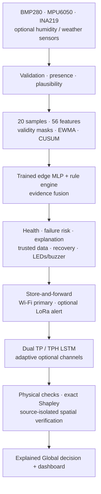

# Final Local + Global Brain architecture

## Local Brain on ESP32-S3

1. Probe only configured digital sensors and give every known instrument an `attached` and `valid` state.
2. Validate finite values, physical ranges and rates. Never substitute zero for a missing instrument.
3. Keep a 20-sample window and generate exactly 56 features: raw/latest values, deltas, mean/std/range/slope, EWMA residuals, CUSUM, meteorological consistency and eight sensor-validity masks.
4. Run the trained MLP (`56→24→12→10`) for normal, spike, drift, frozen, data loss, electrical, mechanical, communication, weather-consistency and station-degradation classes.
5. Fuse MLP probability with deterministic safety rules. Rules can override ML for unsafe data loss and power conditions.
6. Produce confidence, severity, affected sensors, gradient×input top-feature explanation, health attribution, trusted/fallback values and fallback age.
7. Predict station degradation from INA219 power behavior, sensor health, RSSI/queue and repeated anomalies. This is the **warning before station dies** output.
8. Separate electronic recovery (I²C bus/sensor reset) from physical instrument recovery (GPIO/ADC re-arm and operator inspection).
9. Drive LEDs/buzzer and queue telemetry without blocking acquisition.

## Missing-data behavior

The edge MLP was trained with multiple attachment profiles and explicit masks. Current BMP280/MPU6050/INA219 operation is therefore a supported profile—not an accidental partial vector. External humidity and weather instruments remain absent until both configured and valid. Fallback values may support continuity only within their age limit and are labelled; rainfall is never fabricated.

## Global Brain on the laptop/server

- **TP LSTM:** stays operational with current BMP atmospheric inputs.
- **TPH LSTM:** activates after a real SHT31/DHT22 provides a complete 20-sample window.
- **Adaptive channels:** valid rain, wind, direction, solar, motion and power values use robust rolling median/MAD monitoring.
- **Consistency:** atmospheric ranges and dew-point relationship are checked.
- **XAI:** exact feature-coalition Shapley values explain LSTM reconstruction loss; edge top features are retained separately.
- **Spatial reasoning:** a weather event requires at least two fresh nearby stations with independent anomaly evidence and measurement agreement.
- **Isolation:** `HARDWARE` packets can only use hardware neighbours; `SIMULATION` packets can only use simulator neighbours.

## Decision categories

| Category | Meaning |
|---|---|
| `NORMAL` | Local, temporal, adaptive and consistency evidence is normal. |
| `SENSOR_FAULT` | Invalid/data-loss or a localized anomaly points to station hardware. |
| `GENUINE_WEATHER_EVENT` | Independent nearby stations corroborate a physically consistent change. |
| `UNVERIFIED_ANOMALY` | A change exists but real spatial evidence is insufficient. |
| `COMMUNICATION_FAULT` | A previously reporting station exceeds the stale interval. |

## Transport, LoRa and simulator boundary

Wi-Fi/HTTP carries complete telemetry. The FreeRTOS sender drains a bounded queue without blocking sampling. If enabled, LoRa sends only a compact critical-alert payload after Wi-Fi delivery failure and requires a receiver/gateway.

The Station Simulator is manually controlled and uses the same telemetry contract, storage, decision engine and dashboard flow. It can mirror hardware readings as its baseline. It is a demonstration/fault-injection tool, not evidence that a physical sensor produced those readings.
